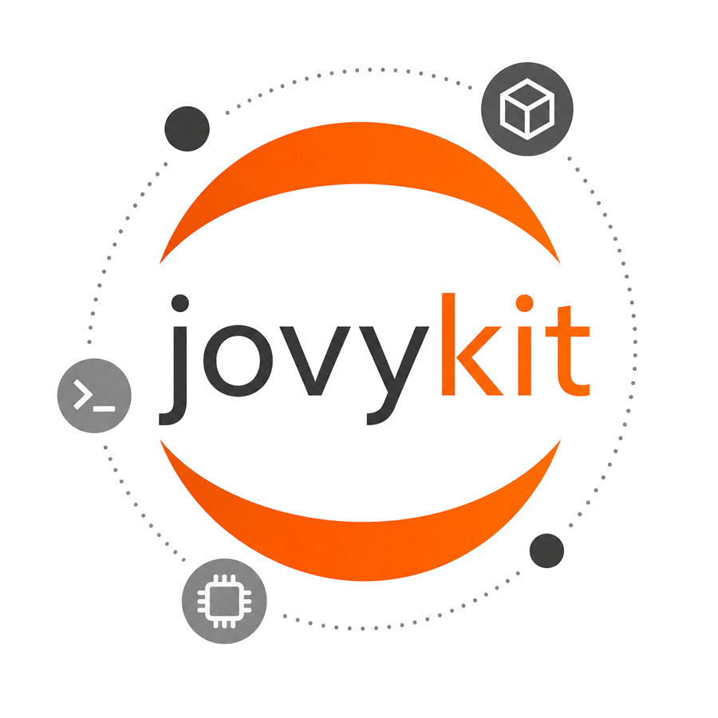

<p align="center">
  
</p>

<h1 align="center">JovyKit</h1>

<p align="center">
  <a href="https://github.com/MihneaTeodorStoica/jovykit/actions/workflows/ci-release.yml"></a>
  <a href="pyproject.toml"></a>
  
  <a href="LICENSE"></a>
  <a href="https://mihneateodorstoica.github.io/jovykit/"></a>
</p>

Project-local JupyterLab containers with a venv-like CLI, layered notebook
images, uv-locked dependencies, and readable Docker Compose output.

```text
.jovy is to JovyKit what .venv is to Python.
```

[Website](https://mihneateodorstoica.github.io/jovykit/) ·
[Wiki](https://github.com/MihneaTeodorStoica/jovykit/wiki) ·
[Issues](https://github.com/MihneaTeodorStoica/jovykit/issues) ·
[GHCR Images](https://github.com/MihneaTeodorStoica/jovykit/pkgs/container/jovykit-base)

## Why JovyKit

JovyKit is for notebook-heavy data science and research projects that should be
easy to start, reproducible later, and still inspectable when something needs
debugging.

- Create a project-local `.jovy/` environment from one command.
- Track direct project packages in `jovy.toml`.
- Compile a deterministic `.jovy/jovy.lock` with uv.
- Build a generated overlay image instead of mutating container state.
- Run JupyterLab through Docker Compose without making Compose the user
  interface.
- Choose notebook image layers from `minimal`, `base`, `extended`, and `full`.
- Use a terminal dashboard for interactive project operations.

## Quick Start

Install from a local checkout:

```bash
python -m pip install -e .
```

Create an environment, add packages, and run JupyterLab:

```bash
jovy init .jovy --image base --gpus auto
jovy add pandas scikit-learn plotly
jovy install
jovy run
```

JovyKit prints the local JupyterLab URL. The default token is `jovykit`.

## Daily Commands

```bash
jovy                  # open the terminal dashboard
jovy status
jovy status --json
jovy add -r requirements.txt
jovy install --upgrade
jovy up
jovy logs --tail 100 --since 10m --timestamps
jovy shell -c "python --version"
jovy exec python --version
jovy down --timeout 10
jovy clean
jovy destroy --keep-image
```

Most commands accept `--env PATH` when you want to operate on a project outside
the current directory tree.

## What It Creates

```text
jovy.toml
work/
.jovy/
  jovy.lock
  Containerfile
  compose.yaml
  state.json
```

`jovy.toml` is the project manifest. `.jovy/` contains generated local
environment files and should stay out of version control.

## Image Layers

Published images use this pattern:

```text
ghcr.io/mihneateodorstoica/jovykit-TYPE:latest
ghcr.io/mihneateodorstoica/jovykit-TYPE:nightly
ghcr.io/mihneateodorstoica/jovykit-TYPE:lts
```

`TYPE` is one of:

- `minimal`: Jupyter runtime plus the core scientific Python stack.
- `base`: everyday data science, classical machine learning, statistics, and
  local data access.
- `extended`: advanced ML, NLP, time series, distributed compute, and API
  tooling.
- `full`: heavier AI, graph, geospatial, big-data, and research tooling.

All image variants include `git`, OpenSSH client tools, `rsync`, and a prepared
`~/.ssh` directory for SSH-backed remotes and file sync.

Build a target locally:

```bash
docker build --target minimal -t jovykit-minimal ./image
docker build --target base -t jovykit-base ./image
docker build --target extended -t jovykit-extended ./image
docker build --target full -t jovykit-full ./image
```

## Configuration

`jovy.toml` can customize runtime environment variables, extra volumes, restart
policy, Jupyter command/logging, Compose Watch behavior, image build arguments,
build target/platform, apt packages, and uv/pip install options.

Use the guided editor:

```bash
jovy config
```

or open the dashboard and run:

```text
config
```

## Repository Layout

```text
jovykit/              Python CLI package
image/                Dockerfile and layered image dependency manifests
site/                 GitHub Pages promotional website
wiki/                 GitHub Wiki page source
.github/workflows/    CI, security, website, wiki, and image automation
```

## Documentation

The website promotes the project and lives in `site/`. Operational
documentation lives in the
[GitHub Wiki](https://github.com/MihneaTeodorStoica/jovykit/wiki), with source
pages in `wiki/`.

## Testing

Run the deterministic test suite with coverage:

```bash
pytest --cov=jovykit --cov-report=term-missing --cov-fail-under=90
```

Docker-facing smoke tests are opt-in:

```bash
pytest -m docker --run-docker
```

## Contributing

Contributions are welcome. See [CONTRIBUTING.md](CONTRIBUTING.md) for the
development workflow and [CODE_OF_CONDUCT.md](CODE_OF_CONDUCT.md) for community
expectations.

## License

JovyKit is licensed under the MIT License. See [LICENSE](LICENSE).
