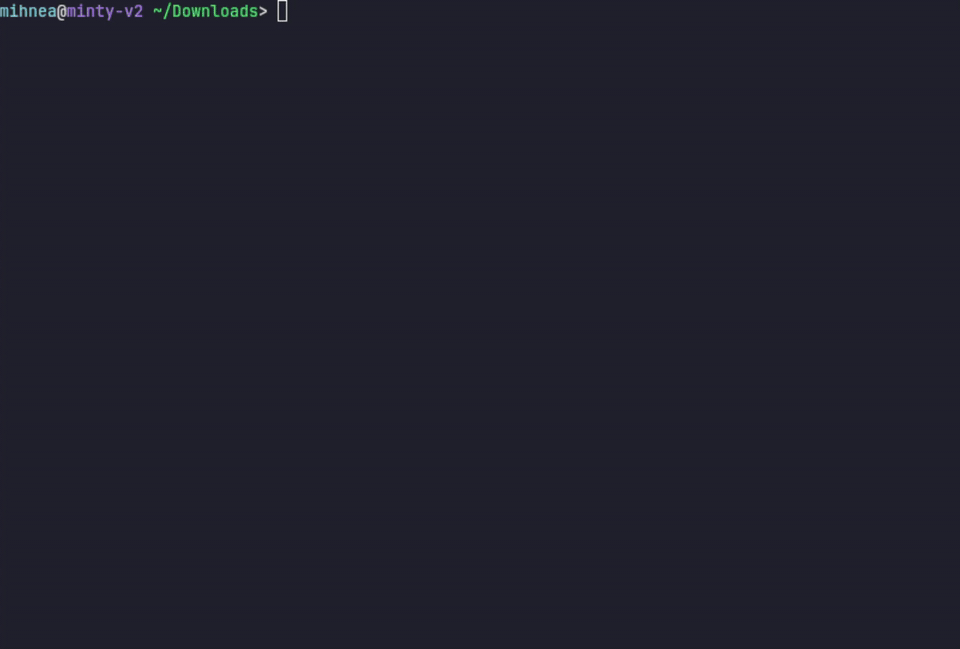

<p align="center">
  
</p>

<h1 align="center">JovyKit</h1>

<p align="center">
  <strong>Disposable JupyterLab environments that feel like Python virtualenvs.</strong>
</p>

<p align="center">
  <a href="https://github.com/MihneaTeodorStoica/jovykit/actions/workflows/ci-release.yml"></a>
  <a href="pyproject.toml"></a>
  
  
  <a href="https://github.com/MihneaTeodorStoica/jovykit/pkgs/container/jovykit"></a>
  <a href="LICENSE"></a>
</p>

JovyKit gives each project a readable Dockerized JupyterLab environment.
Run `jovy init`, start Jupyter, throw the container away, keep the notebooks.

## Install

JovyKit requires Docker Engine and the Docker Compose plugin.
On macOS and Windows, install Docker Desktop first.
On supported Linux distros, JovyKit can print or run the Docker install plan.

```bash
pip install jovykit
# or
uv tool install jovykit

jovy install-docker --dry-run
jovy doctor
jovy --version
```

Run `jovy install-docker --yes` only after reading the dry run output.

## Quick Start

```bash
pip install jovykit

jovy init
jovy up -d
jovy open
```

<p align="center">
  
</p>

Use a pinned Python image or GPU mode when you need it:

```bash
jovy init --python 3.13
jovy init --gpu all --python 3.13
```

## Why?

Machine learning environments are annoying.

- Conda environments drift.
- Docker Compose is repetitive.
- Jupyter setup takes boilerplate.
- GPU configuration is fragile.
- Reproducing environments across machines is painful.

JovyKit makes Dockerized Jupyter environments feel lightweight and disposable.

## What You Get

- One command creates `compose.yaml`, `Dockerfile`, `requirements.txt`, `work/`, and `.jupyter/`.
- Notebooks and Jupyter settings persist; container state stays disposable.
- `jovy add` and `jovy remove` edit `requirements.txt`.
- `up`, `down`, `start`, `stop`, `config`, `logs`, `build`, and `watch` behave like Docker Compose.
- GPU support is explicit with `jovy init --gpu all`.
- `jovy compose ...` is the Docker Compose escape hatch.

There is no JovyKit config file.
Edit `compose.yaml`, `Dockerfile`, or `requirements.txt` directly.

## Requirements

- Python 3.9 or newer on the host.
- Docker Engine and the Docker Compose plugin, or Docker Desktop on macOS/Windows.
- Linux auto-install support for Ubuntu, Debian, Fedora, RHEL, and CentOS.
- Optional GPU runtime support for `gpus: all`.

`jovy doctor` checks Docker, Compose, daemon access, GPU support, and project files.

## Common Commands

```bash
jovy install-docker --dry-run
jovy doctor
jovy add pandas scikit-learn
jovy build
jovy watch
jovy logs -f
jovy status
jovy shell
jovy down
jovy compose ps
```

## How JovyKit Works

`compose.yaml` is runtime.
`Dockerfile` is the project overlay.
`requirements.txt` is project Python packages.
Python comes from the selected image tag, for example `:base-python-3.12`.

- `jovy` initializes an empty directory, or prints help in an existing project.
- `jovy init` creates `compose.yaml`, `Dockerfile`, `requirements.txt`, `.devcontainer/devcontainer.json`, `work/`, and `.jupyter/`.
- `jovy status`, `shell`, `run`, `open`, and `doctor` add small Jupyter-focused conveniences.

## Images

Image levels map to published JovyKit images:

```text
ghcr.io/mihneateodorstoica/jovykit:minimal-python-3.13
ghcr.io/mihneateodorstoica/jovykit:base-python-3.12
ghcr.io/mihneateodorstoica/jovykit:extended-python-3.13
ghcr.io/mihneateodorstoica/jovykit:full-python-3.13
```

`minimal` and `base` publish Python 3.9 through 3.14 tags.
`extended` and `full` publish Python 3.11 through 3.13 tags.
`latest` points at `minimal-python-3.14`. Scheduled images also get level-specific tags such as `base-nightly-python-3.11`, `base-weekly-python-3.11`, and `base-monthly-python-3.11`.

`minimal`, `base`, and `extended` are curated cuts from the full stack.
`full` is intentionally huge and keeps heavyweight ML, AI, cloud, distributed,
and app runtimes in one batteries-included layer.

```bash
jovy init --image-level minimal --python 3.11
jovy init --image-level base --python 3.12
jovy init --image-level extended --python 3.13
jovy init --image-level full --python 3.13
```

The generated Compose file passes only `JOVY_BASE_IMAGE`.
It does not pass a Python version build argument.

Build published image targets from the single multi-stage Dockerfile:

```bash
./build.sh minimal
./build.sh --python-version 3.13 base
./build.sh --python 3.11 --python 3.12 --python 3.13 all
./build.sh --python 3.14 --latest minimal
./build.sh --python 3.11 --channel nightly base
```

With no args, `./build.sh` builds all supported image and Python tag pairs.

## Dependencies

Use `requirements.txt`.

```bash
jovy add pandas scikit-learn
jovy remove pandas
```

Compose Watch rebuilds when dependency files change:

```bash
jovy watch
```

## Persistent Files

Generated projects mount only the durable user paths:

```text
./work      -> /home/jovyan/work
./.jupyter  -> /home/jovyan/.jupyter
```

Project notebooks and Jupyter settings survive rebuilds and container removal.
Other container state is disposable.

## GPU

GPU support is explicit:

```bash
jovy init --gpu none
jovy init --gpu all
```

By default, `jovy init` uses `all` when a local GPU is detected.
`none` omits the Compose GPU field.
`all` writes Compose `gpus: all`.

## Repository Checks

```bash
ruff check .
black --check .
mypy jovykit tests main.py
pytest --cov=jovykit --cov-report=term-missing
```

Docker checks are opt-in:

```bash
pytest -m docker --run-docker
```

## Repository Layout

```text
jovykit/              Python CLI package
image/                Published image layers
site/                 GitHub Pages site
wiki/                 GitHub Wiki source
.github/workflows/    CI, release, docs, and image automation
```

## License

JovyKit is licensed under the MIT License.
See [LICENSE](LICENSE).
